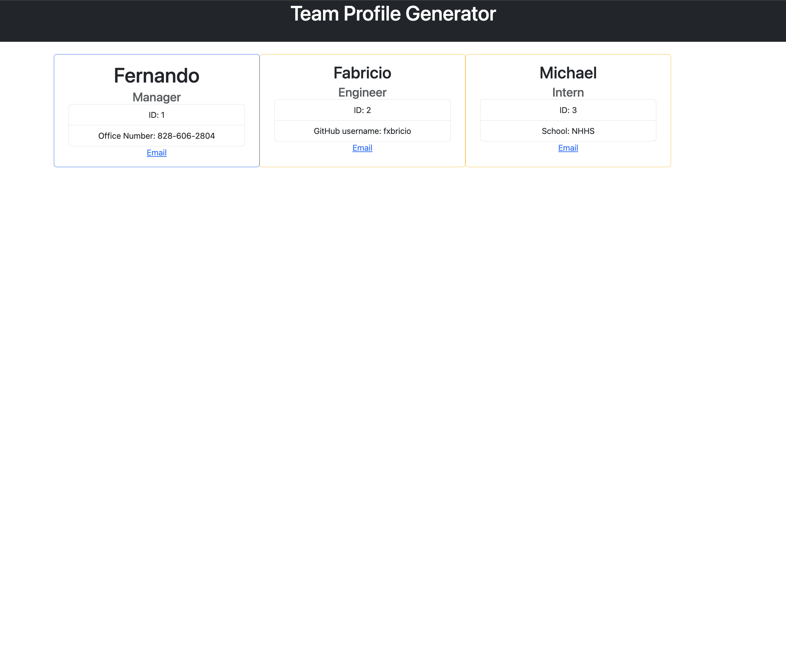
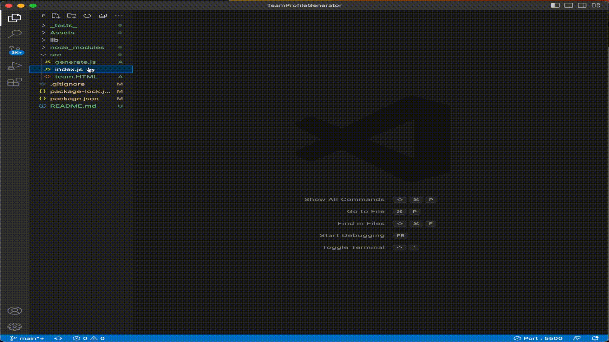

# Team Profile Generator 

  # 

  ## Table of Contents
  - [Description](#description)
  - [Installation](#install)
  - [Usage](#usage)
  - [License](#license)
  - [Questions](#questions)
  
  ## Description
  This command line prompt takes in information about employees on a software engineering team, then generates an HTML webpage that displays summaries for each person
  
  ## Installation
  - npm i
  - node index.js
  
  ## Usage
  
  
  
  ## License 
  MIT
  
  ## Questions
  How to reach me...
  - GitHub: https://github.com/fernandot10
  - Email: Fernando.t10@outlook.com
